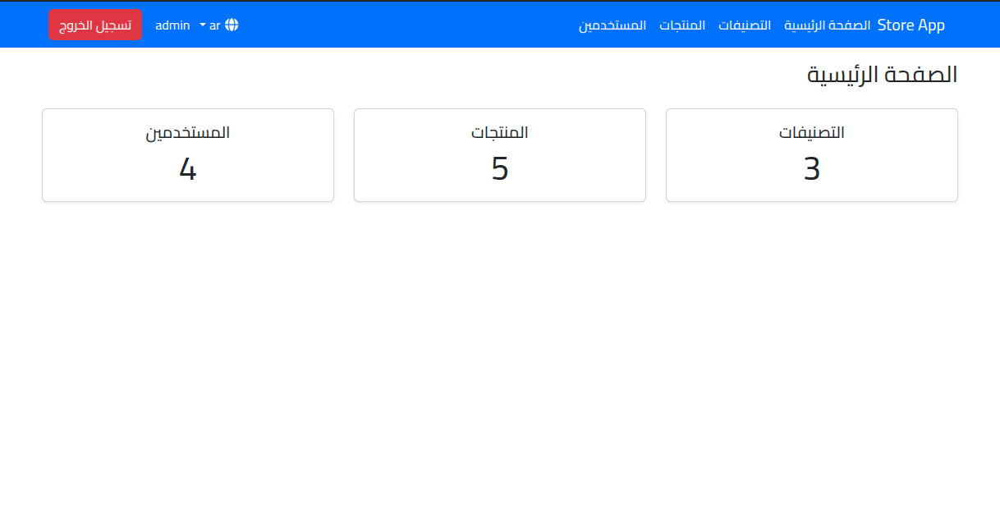
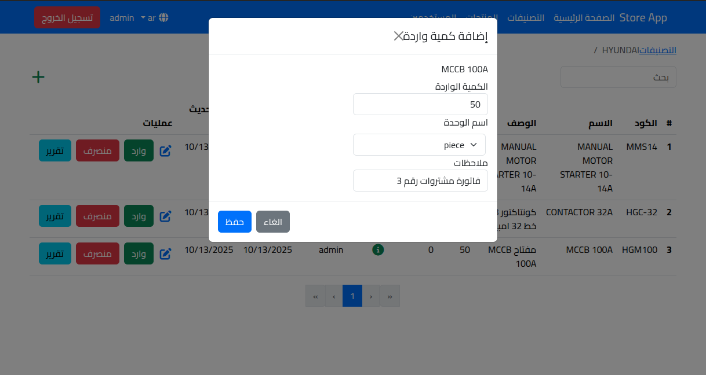
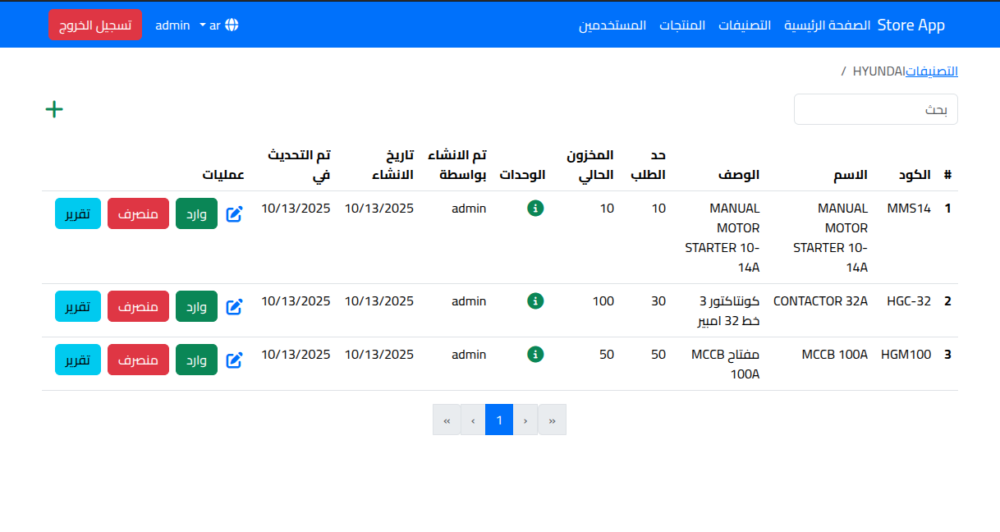
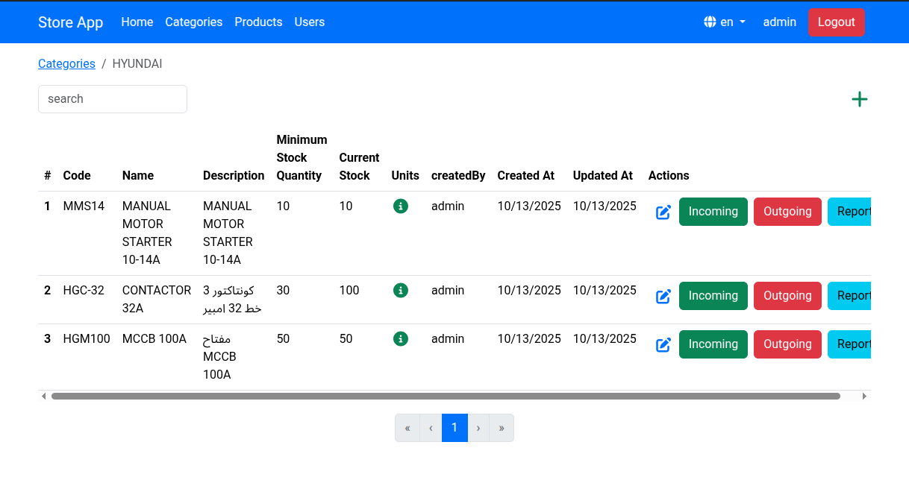
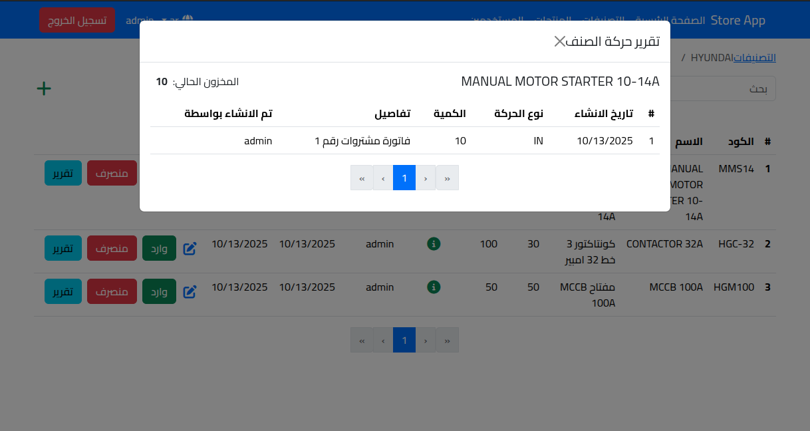
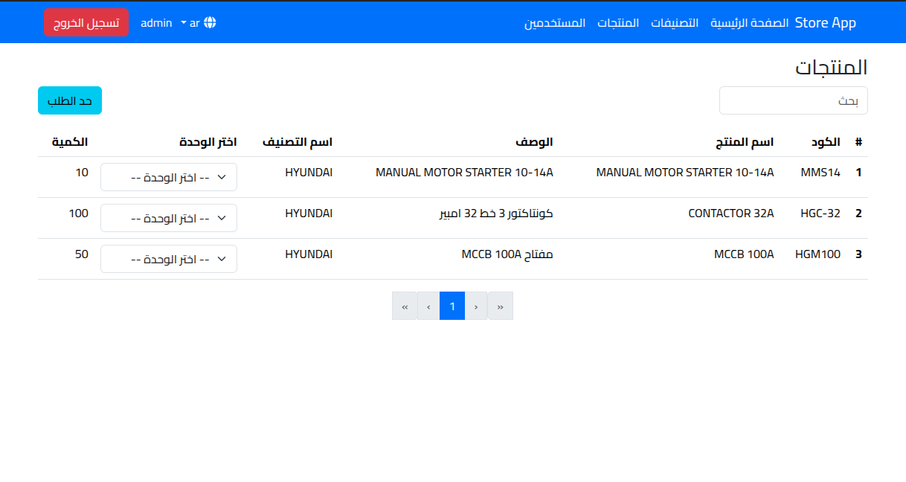
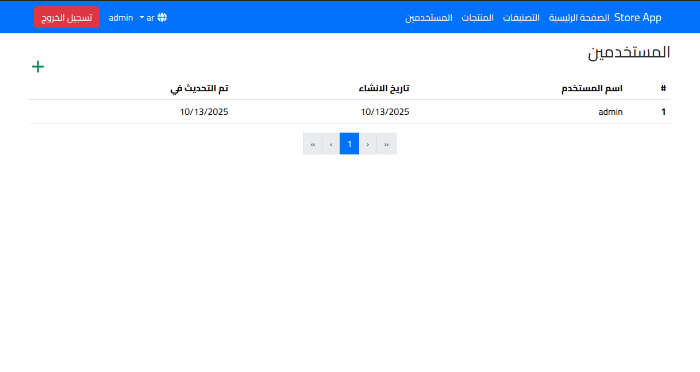
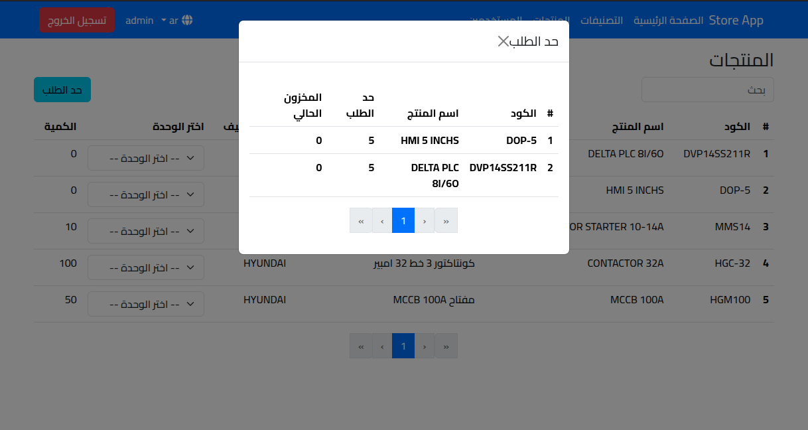
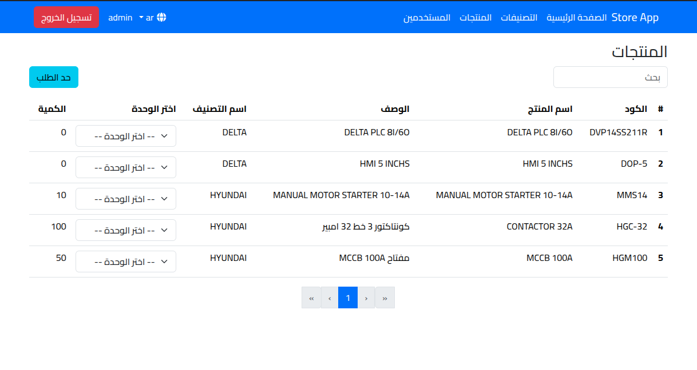
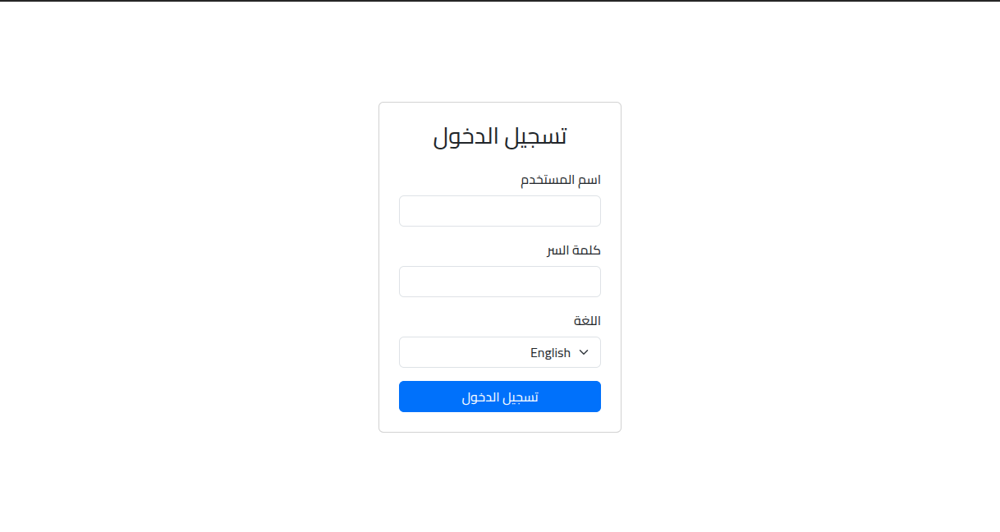

🏪 Store Management Web App

A full-stack store management system built with Vue.js (Options API) and Express.js (TypeScript) to manage products, users, and sales efficiently.

🚀 Features

- Secure JWT authentication with bcrypt password hashing.
- Low Stock Management Page that displays all products with quantities below a defined limit.
- MongoDB database for storing inventory, users, and sales.
- Joi validation and express-async-handler for robust error handling.
- Helmet and express-rate-limit for enhanced API security.
- Responsive and clean Vue.js frontend UI.

🛠️ Tech Stack

Frontend: Vue.js (Options API)
Backend: Express.js, TypeScript
Database: MongoDB

## How To run The App
#### 1- clone the app
```sh
git clone https://github.com/abuomerSD/store-app.git
```

#### 2- navitage to backend folder
```sh
cd store-app
```
then
```sh
cd backend/
```

#### 3- install typescript
```sh
npm install typescript
```

#### 4- complie typescript file to javascript
```sh
tsc
```

#### 5- install the dependencies
```sh
npm install
```

#### 6- create .env file with this variables
```.env
MONGODB_URI = (Your MongoDB URL)
PORT = 5000
NODE_ENV= development
JWT_SECRET = wSvf+vEzfy0veqSoS2ZZEo5f2+FaRR4Vz5TiP4WRWzk=
CORS_ORIGIN = (Your Frontend URL)
DEFAULT_USERNAME = admin
DEFAULT_PASSWORD = ewqeqw12345
```

#### 7- now run the backend
```sh
node dist/app.js 
```

#### 8- open new terminal and navigate to the frontend folder then install the dependencies
```sh
npm install
```

#### 9-create .env file and create this variable inside of it
```.env
VITE_API_URL = (You Server URL example: http://localhost:5000/api/)
```

#### 10- now run the frontend
```sh
npm run dev
```

the front end url will appear on the terminal, navigate to it.
navigate to `/admin` and login with DEFAULT_USERNAME, DEFAULT_PASSWORD which you have created in the backend environment variables.

#### Contgratulations The App is Now Working
#### you can Watch A video About the app here: 

[](https://www.youtube.com/watch?v=vpS_U7lk7PE)

Images:











